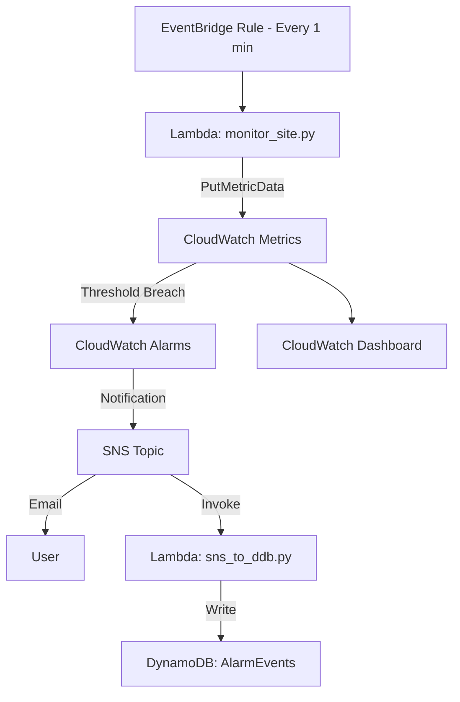

# Website Health Monitoring & Alarm Logging System
Author: Khalid Hasan (S8135795)  
Project Title: MNCloud –  Website Health Monitoring with CloudWatch, DynamoDB & CDK

Overview

This system monitors the health of a target website (e.g., [BBC](https://www.bbc.com)) using AWS Lambda and CloudWatch, triggers alarms when availability or latency thresholds are breached, and stores alarm notifications into DynamoDB for audit and analysis.  

It is implemented using the AWS CDK (Python) and fully deploys:
- Lambda functions:
  - `monitor_site.py`: Periodic health checker, publishing CloudWatch metrics.
  - `sns_to_ddb.py`: SNS subscriber that logs alarm events into DynamoDB.
- CloudWatch metrics & alarms for latency (p95) and availability (99% threshold).  
- SNS topic with email subscription for notifications.  
- DynamoDB table (`AlarmEvents`) to persist alarm events with timestamps.  
- CloudWatch Dashboard for visualization.  

System Architecture

⚙️ Installation & Deployment Guide

Prerequisites:

1. Python 3.9+ and virtualenv

2. AWS CLI configured (aws configure)

3. Node.js & AWS CDK installed globally

npm install -g aws-cdk

4. Clone Repository

git clone https://github.com/<your-username>/<your-repo>.git
cd <your-repo>

5. Create Virtual Environment
python3 -m venv .venv
source .venv/bin/activate
pip install -r requirements.txt

6. Deploy Stack

cdk deploy

7. Post-Deployment
Confirm SNS email subscription (check your inbox).

Visit CloudWatch → Dashboards → WebsiteHealth to view metrics.

Check DynamoDB → AlarmEvents for stored alarm notifications.

** Repository Structure
python

.
app.py                  # CDK entry point
cdk.json                # CDK configuration
 stack/
   khalid_stack.py     # Main stack definition
 lambda/
     monitor_site.py     # Website monitoring Lambda
    sns_to_ddb.py       # SNS-to-DynamoDB Lambda

 Final System Delivery & Evaluation

System Product

Fully functional monitoring and alerting pipeline.

Extended with DynamoDB integration for alarm persistence.

Innovative dashboard for real-time visualization.

Easy deployment via CDK (cdk deploy) — usable by third parties.

Project Evaluation Report 

Implementation Process: Iterative build → monitoring → alarms → SNS → DynamoDB.

Testing:

Lowered thresholds temporarily (e.g., availability = 1.0) to force alarms.

Published test messages in SNS console.

Verified DynamoDB entries and CloudWatch Logs.

Challenges:

Initial Lambda environment variable conflict (AWS_REGION reserved).

Path issues for Lambda assets.

Fixed with correct RemovalPolicy and environment cleanup.

Strengths: Serverless, scalable, near real-time monitoring.

Limitations:

Limited to HTTP GET checks.

High-frequency monitoring may increase AWS costs.

Future Improvements:

Multi-region monitoring.

Slack/Teams integration.

Advanced anomaly detection with ML.

Ethics:

Avoid excessive load on target websites.

Respect data privacy in logs and alarm events.

Project Documentation 
User Manual: (see Installation above).

Troubleshooting:

Problem: No metrics in CloudWatch → Fix: Ensure Lambda runs & has IAM cloudwatch:PutMetricData.

Problem: No SNS email → Fix: Confirm email subscription.

Problem: No DynamoDB entries → Fix: Check Lambda logs /aws/lambda/SnsToDdbFn.

Meeting Minutes & Task Distribution: Iterative tasks tracked (design, code, testing).

Team Member Evaluation: Self-managed project, improvements noted in debugging skills.

Version Control: GitHub used (main branch with commits for stack + Lambdas).

Project Difficulty Level 
Rated V High: full CDK stack with Lambda, SNS, CloudWatch, DynamoDB, IAM, and dashboard.

IT Professionalism:
Clean Python code, AWS CDK best practices, comments with AWS docs links.

Testing logs included.

README doubles as installation + evaluation package.

Human Factors & Privacy
Email notifications restricted to verified subscribers.

DynamoDB stores only alarm metadata .

Ethical monitoring principles followed.

References

AWS CDK Documentation: https://docs.aws.amazon.com/cdk/api/v2/python/

AWS CloudWatch Metrics & Alarms: https://docs.aws.amazon.com/AmazonCloudWatch/latest/monitoring

AWS Lambda Developer Guide: https://docs.aws.amazon.com/lambda/latest/dg

AWS DynamoDB Developer Guide: https://docs.aws.amazon.com/amazondynamodb/latest/developerguide

Author
Khalid Hasan
Master of Applied IT, Victoria University
